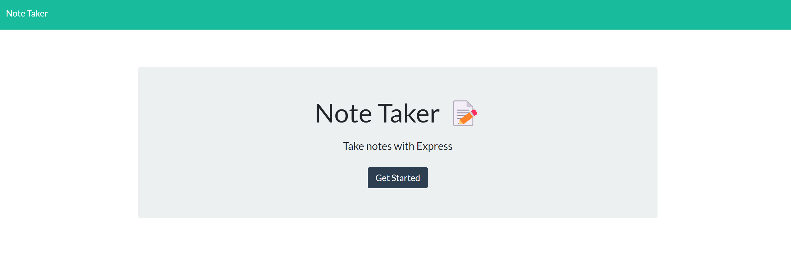
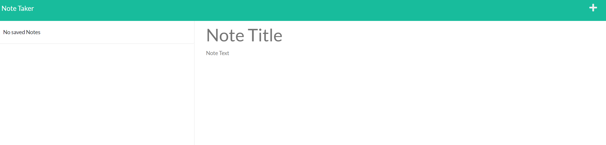
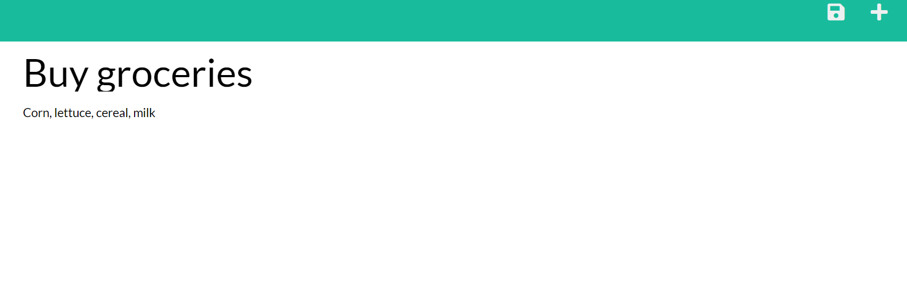
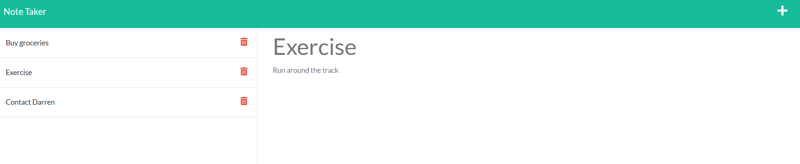

# note-taker

## Description
note-taker is a basic, full stack application for taking, tracking, and storing personal notes. note-taker utilizes express.js to run back end storage.  Using the application, users may write notes for themselves that they store for later use.

## Table of Contents
- [Installation](#installation)
- [Usage](#usage)
- [Badges](#badges)
- [License](#license)
- [Questions](#questions)

## Installation
To run the application users must first download NodeJS. A step by step guide to download NodeJS onto your machine may be found [here.](https://coding-boot-camp.github.io/full-stack/nodejs/how-to-install-nodejs) Upon installation, navigate to the note-taker folder using command line interface, run "npm i", and then "node server.js" to activate the express.js server. 

## Usage
Upon navigating to the home page, a user will see the following screen displayed. 

Upon clicking the "Get Started" button, a user will be taken to the following page. If no previous notes have been saved, users will see an identical page to the screenshot below. Otherwise, notes previously written and saved will populate the page. 

Once the user has populated both the "Note title" and "Note text" fields with text inputs, a save icon will appear next to the "New Note" button at the top right of the page. The following screenshot demonstrates the appearance of the save button once both fields have been populated with text. 

Saved notes will populate the column on the left side of the page. Should a user click any of the notes in the list, that given note will automatically populate both the "Note title" and "Note text" section, as seen in the screenshot attached below. Additionally, each saved not has a delete button attached to it that will delete the note in question upon a user clicking the button. 

## Badges

## License 
Copyright 2022 Colby Sanchez Wagenbach
Permission is hereby granted, free of charge, to any person obtaining a copy of this software and associated documentation files (the "Software"), to deal in the Software without restriction, including without limitation the rights to use, copy, modify, merge, publish, distribute, sublicense, and/or sell copies of the Software, and to permit persons to whom the Software is furnished to do so, subject to the following conditions:

The above copyright notice and this permission notice shall be included in all copies or substantial portions of the Software.

THE SOFTWARE IS PROVIDED "AS IS", WITHOUT WARRANTY OF ANY KIND, EXPRESS OR IMPLIED, INCLUDING BUT NOT LIMITED TO THE WARRANTIES OF MERCHANTABILITY, FITNESS FOR A PARTICULAR PURPOSE AND NONINFRINGEMENT. IN NO EVENT SHALL THE AUTHORS OR COPYRIGHT HOLDERS BE LIABLE FOR ANY CLAIM, DAMAGES OR OTHER LIABILITY, WHETHER IN AN ACTION OF CONTRACT, TORT OR OTHERWISE, ARISING FROM, OUT OF OR IN CONNECTION WITH THE SOFTWARE OR THE USE OR OTHER DEALINGS IN THE SOFTWARE.

## Questions
You can find me on GitHub @csanchezwagenbach or you can send me an email at csanchezwagenbach@gmail.com
  